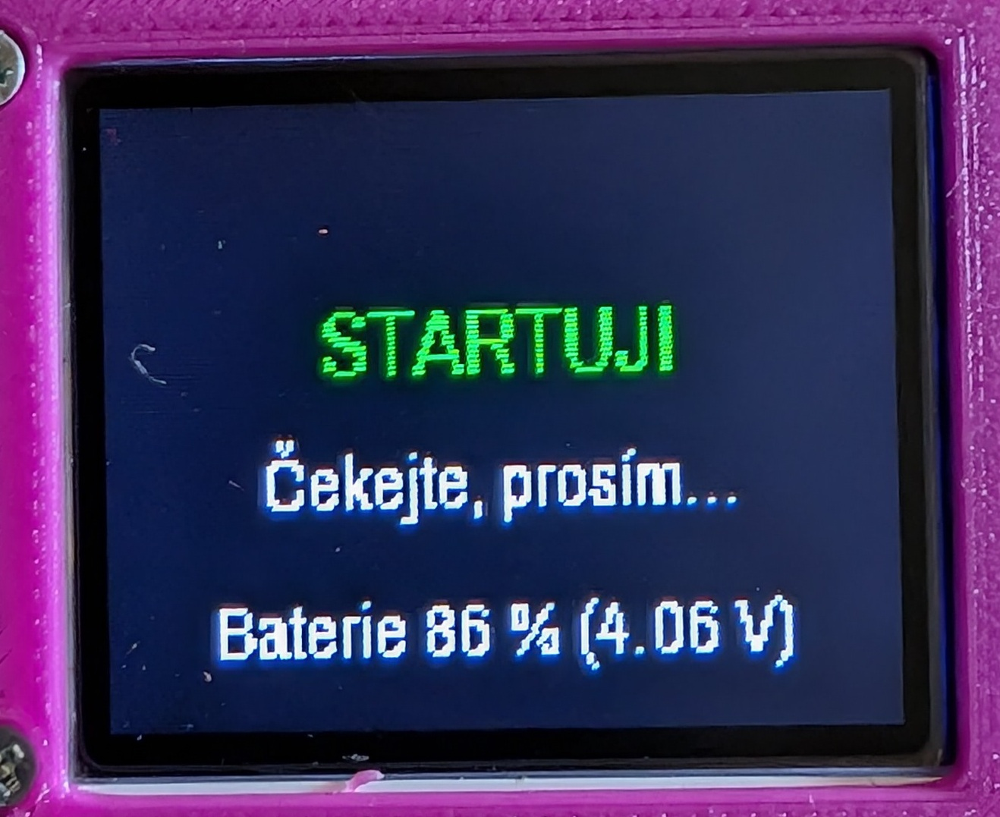
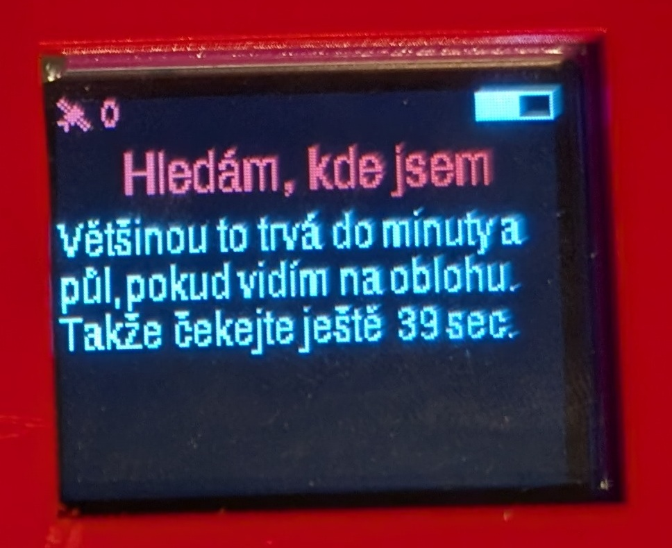
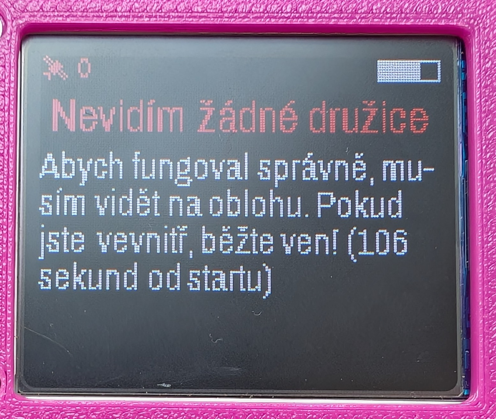
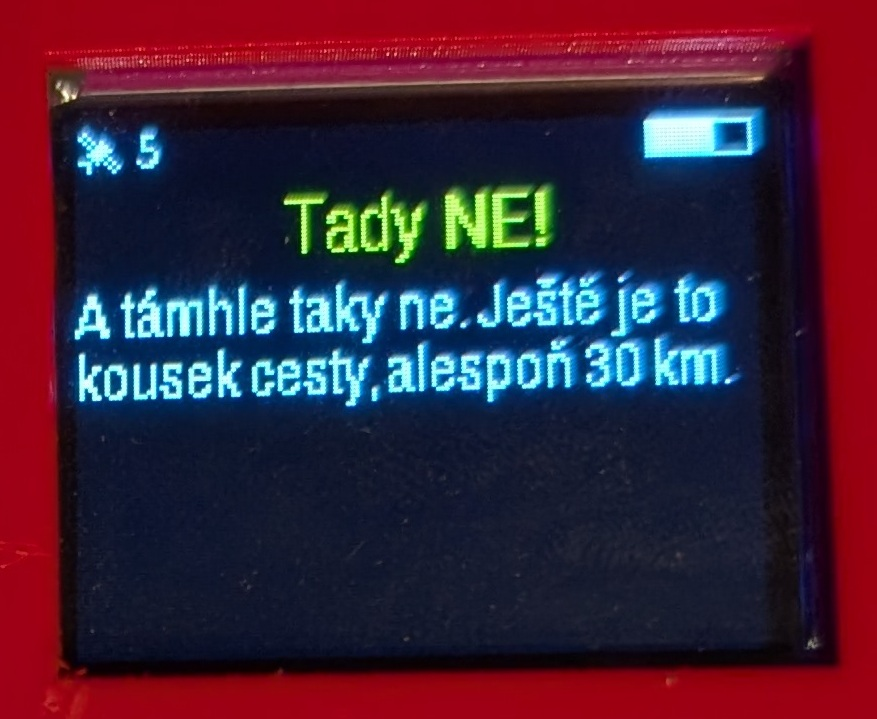
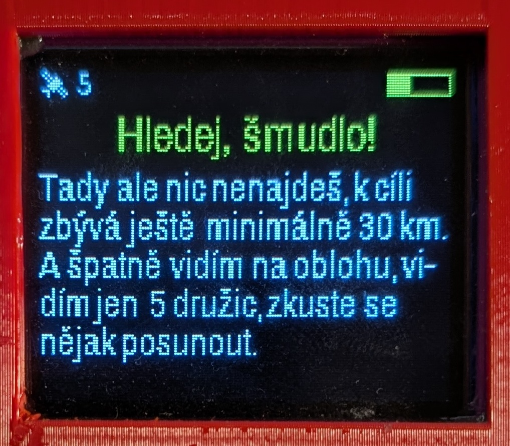
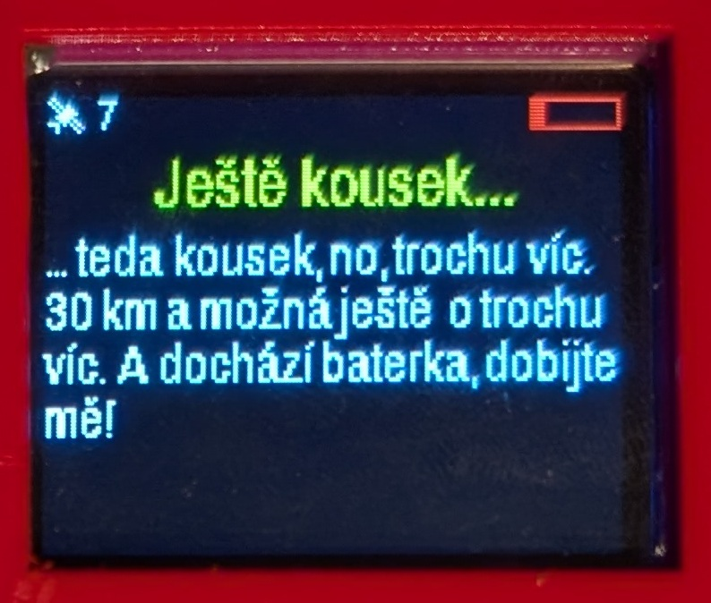
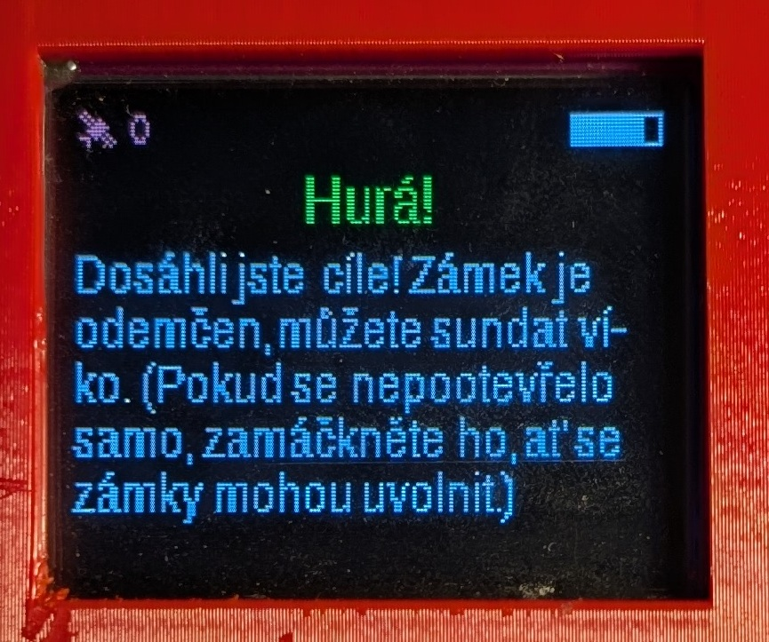

# GeoVault - GPS trezor

Kouzelná krabička, která se sama otevře až na správném místě. A informace, jak najít správné místo, nedává moc konkrétně.

Box zhruba 12x12x12 cm, který zvenčí nemá žádné šrouby ani jiné spojovací prvky. Kouká jen USB-C pro nabíjení, vypínač a displej. A na správném místě víko vyskočí ven.

 

Uvnitř je kromě elektroniky úložný prostor cca 58x110x105 mm, do kterého lze umístit cílovou odměnu.

(Na tomhle obrázku chybí na kolících pružinky, které tlačí víko ven - důležitá součástka.)

 

Co se ukazuje na displeji?

|  |  | 
| ----------- | ----------- | 
|   |    |
|   |    |
|   |    |
|   |  |

## Použitá technika

Displej 1.8" 128*160 SPI ST7735S
https://s.click.aliexpress.com/e/_oFWSbIL

GPS modul QUESCAN QU728F NEO-7N 
https://s.click.aliexpress.com/e/_onFHu2X

Kontrolér ESP32 supermini
https://s.click.aliexpress.com/e/_omWAY7h

Modul pro ochranu a dobíjení lipol baterky
https://www.laskakit.cz/nabijecka-li-ion-clanku-tp4056-s-ochranou-usb-c/

Step-up na 5 V
https://www.laskakit.cz/laskakit-bat-boost-menic-5v-0-6a-dio6605b/

Dvě mikroserva 

# Sestavení

Schema je [adresáři doc](/doc/schema.svg)

Na každé straně krabičky je jedna deska - na jedné straně napájení (akumulátor, nabíjecí obvod, step-up, vypínač a USB-C konektor) plus servo zámku, na druhé straně procesorová část (mikrokontrolér, GPS, displej) plus servo druhého zámku.

 

Zámek je odvozen od tohoto modelu: https://www.printables.com/model/680586-servo-operated-lock-remix

# Aplikace

Aplikace vystavuje WiFi a na něm webové rozhraní, kde vypisuje stav zařízení, umožňuje otevřít/zavřít zámek a nastavit cílové souřadnice.

* Wifi AP: GeoVault
* heslo: SuperTajneHeslo2

Webový server pak běží na http://192.168.10.1/ , ale WiFi by si mělo samo otevřít prohlížeč po připojení - jako captive portál ("Přihlašte se do sítě WiFi").
Konfigurace wifi a IP adres je v souboru [EasyWebServer_config.h](/GeoVault/EasyWebServer_config.h).

 

 

Na speciální adrese http://192.168.10.1/servo lze manuálně nastavit pokyny pro posun serv - aby se dalo nastavit, jaké hodnoty jsou správné pro plné otevření a zavření. Konbfiguraci hodnot je pak potřeba zadat do souboru [pinout.h](/GeoVault/pinout.h) položek

```
#define SERVO1_OTEVRENO 20
#define SERVO1_ZAVRENO 130
#define SERVO1_SMER_OTEVIRANI -1

#define SERVO2_OTEVRENO 20
#define SERVO2_ZAVRENO 130
#define SERVO2_SMER_OTEVIRANI -1
```

## Sestavení aplikace

Verze desky ESP32 v Arduino IDE **musí** být 2.0.x (nyní 2.0.17). Na 3.0.x to fungovat nebude.

Konfigurace desky:
* deska: ESP32C3 Dev module
* flash mode: DIO (jinak tahle deska neběží!)
* CDC On Boot: enabled
* CPU speed: 80 MHz
* flash speed: 40 MHz
* partition scheme: default 4 MB with SPIFFS (1.2 MB APP/1.5 MB SPIFFS)

Knihovny:
* Web server: https://github.com/ESP32Async/ESPAsyncWebServer 3.7.7 a  https://github.com/ESP32Async/AsyncTCP 3.4.0
* ESP32 analog read: https://github.com/madhephaestus/ESP32AnalogRead 0.3.0
* Tasker: https://github.com/joysfera/arduino-tasker 2.0.3
* Displej: Adafruit GFX Library https://github.com/adafruit/Adafruit-GFX-Library 1.12.0 + Adafruit BusIO https://github.com/adafruit/Adafruit_BusIO 1.17.0 + Adafruit ST7735 and ST7789 Library https://github.com/adafruit/Adafruit-ST7735-Library 1.11.0
* GPS: TinyGPSPlus https://github.com/mikalhart/TinyGPSPlus 1.0.3
* Servo: ESP32Servo https://madhephaestus.github.io/ESP32Servo/files.html 3.0.7

Detailní výpis z kompilace:
```
FQBN: esp32:esp32:esp32c3:CDCOnBoot=cdc,CPUFreq=80,FlashFreq=40,FlashMode=dio

Using library Async TCP at version 3.4.0 in folder: E:\dev.moje\arduino\libraries\Async_TCP 
Using library ESP Async WebServer at version 3.7.7 in folder: E:\dev.moje\arduino\libraries\ESP_Async_WebServer 
Using library Tasker at version 2.0.3 in folder: E:\dev.moje\arduino\libraries\Tasker 
Using library Adafruit GFX Library at version 1.12.0 in folder: E:\dev.moje\arduino\libraries\Adafruit_GFX_Library 
Using library Adafruit BusIO at version 1.17.0 in folder: E:\dev.moje\arduino\libraries\Adafruit_BusIO 
Using library Adafruit ST7735 and ST7789 Library at version 1.11.0 in folder: E:\dev.moje\arduino\libraries\Adafruit_ST7735_and_ST7789_Library 
Using library TinyGPSPlus at version 1.0.3 in folder: E:\dev.moje\arduino\libraries\TinyGPSPlus 
Using library ESP32Servo at version 3.0.7 in folder: E:\dev.moje\arduino\libraries\ESP32Servo 
Using library ESP32AnalogRead at version 0.3.0 in folder: E:\dev.moje\arduino\libraries\ESP32AnalogRead 
Using library DNSServer at version 2.0.0 in folder: C:\Users\brouzda\AppData\Local\Arduino15\packages\esp32\hardware\esp32\2.0.17\libraries\DNSServer 
Using library FS at version 2.0.0 in folder: C:\Users\brouzda\AppData\Local\Arduino15\packages\esp32\hardware\esp32\2.0.17\libraries\FS 
Using library WiFi at version 2.0.0 in folder: C:\Users\brouzda\AppData\Local\Arduino15\packages\esp32\hardware\esp32\2.0.17\libraries\WiFi 
Using library Wire at version 2.0.0 in folder: C:\Users\brouzda\AppData\Local\Arduino15\packages\esp32\hardware\esp32\2.0.17\libraries\Wire 
Using library SPI at version 2.0.0 in folder: C:\Users\brouzda\AppData\Local\Arduino15\packages\esp32\hardware\esp32\2.0.17\libraries\SPI 
Using library SPIFFS at version 2.0.0 in folder: C:\Users\brouzda\AppData\Local\Arduino15\packages\esp32\hardware\esp32\2.0.17\libraries\SPIFFS 

```
